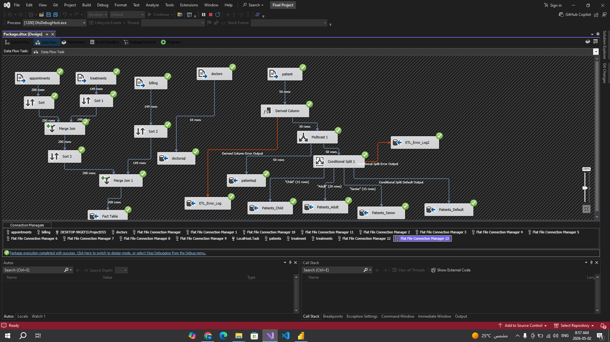
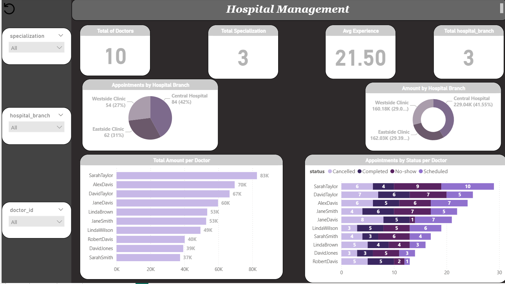
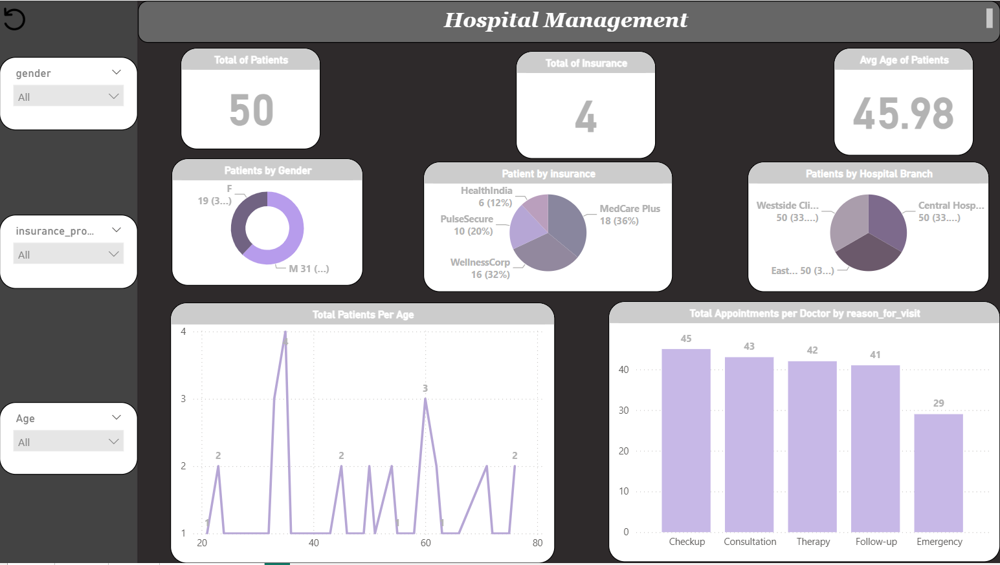
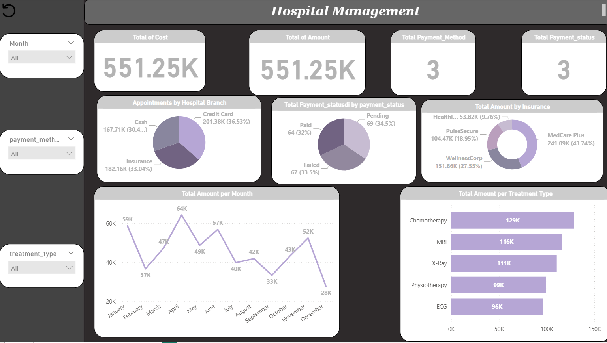

# 🏥 Hospital Management System — BI Solution


> End-to-end Business Intelligence solution for a Hospital Management System — DSS Final Project 2026

---

## 📌 Project Overview

| Component | Tool | Description |
|-----------|------|-------------|
| ETL Pipeline | SSIS | Extract, Transform & Load from 5 CSV sources |
| Data Warehouse | SQL Server | Fact & Dimension tables |
| Visualization | Power BI | 4 interactive dashboards |

---

## 📁 Dataset

| File | Description | Rows |
|------|-------------|------|
| `patients.csv` | Patient demographics & insurance data | 50 |
| `doctors.csv` | Doctor profiles & specializations | 10 |
| `appointments.csv` | Appointment dates, times & statuses | 200 |
| `treatments.csv` | Treatment types, costs & dates | 200 |
| `billing.csv` | Billing amounts & payment statuses | 200 |

---

## ⚙️ ETL Pipeline (SSIS)

```
✅ Sort (×4)           → Sort by appointment_id & treatment_id
✅ Merge Join (×2)     → Join appointments + treatments + billing
✅ Multicast (×2)      → Load to Fact Table + Staging Table
✅ Derived Column      → Calculate patient Age using DATEDIFF
✅ Conditional Split   → Classify patients: Child / Adult / Senior
✅ Script Task (×2)    → Message Box at ETL Start & End
✅ Error Output (×2)   → ETL_Error_Log for failed rows
```

 

---

## 📊 Power BI Dashboards

### 🏠 Home Page


### 👨‍⚕️ Doctors Dashboard
 

- SarahTaylor → highest appointments (29) & revenue (83K)
- Central Hospital handles **42%** of all appointments

### 👥 Patients Dashboard


- Total: **50 patients** | Avg Age: **45.98**
- Gender: **62% Male** / **38% Female**
- MedCare Plus = most used insurance (36%)

### 💰 Financial & Operations Dashboard
 
 
- Total Revenue: **551.25K**
- Chemotherapy = highest revenue (129K)
- Peak month: **May (64K)**

---

## ❓ Business Questions Answered

1. What is the total monthly revenue generated?
2. Which doctor has the highest number of appointments?
3. What is the appointment cancellation rate?
4. What are the most used payment methods?
5. What is the distribution of patients by age group?
6. Which specialization generates the highest cost?
7. What percentage of bills remain unpaid?
8. Which hospital branch has the highest volume?
9. What is the average treatment cost per type?
10. How does patient registration trend over time?

---

## 🗄️ Output Tables

| Table | Description |
|-------|-------------|
| `Fact_Table` | Full joined fact data |
| `Staging_Table` | Raw copy for audit |
| `patientsql` | All patients with Age |
| `doctorsql` | Doctor profiles |
| `Patients_Child / Adult / Senior` | Age-segmented tables |
| `ETL_Error_Log / Log2` | Error tracking tables |

---

## 🛠️ Tech Stack

`SSIS` · `SQL Server` · `Power BI` · `DAX` · `ETL` · `Data Warehouse`

---

## 👥 Team Members

| Name |
|------|
| Mohamed Fathy Seer Gomaa |
| Mohamed Ayman Hussein Mahmoud |
| Amany Ashour Saad |

## 🎓 Course Instructor

| Role | Name |
|------|------|
| Teaching Assistant | Mohamed Ahmed Sofy Mohamed |

---
*DSS Final Project — 2026*
